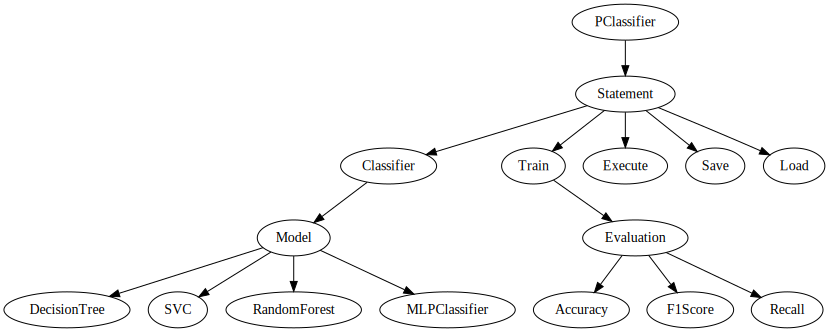
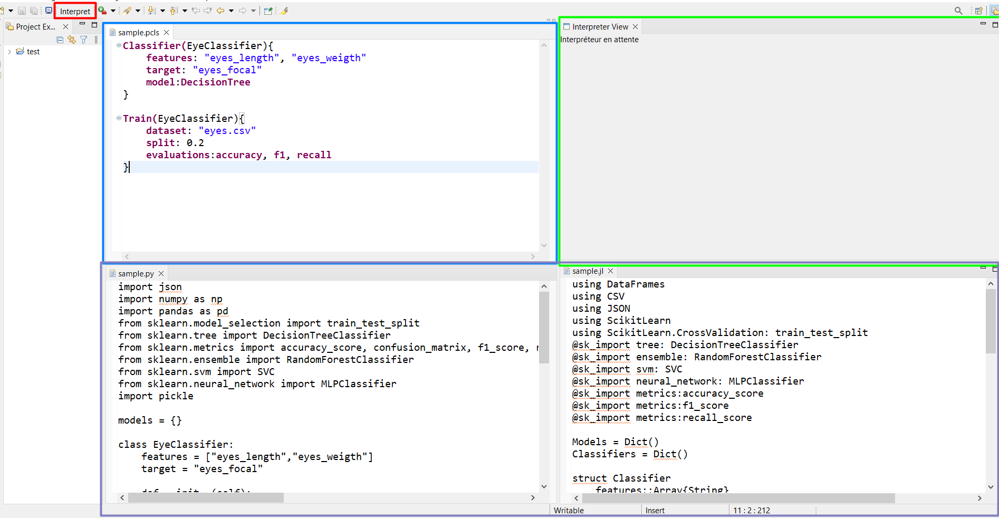

# PClassifier

<p align="center">
  
</p>

PClassifier est un DSL créé avec Xtext qui permet de générer des programmes Python et Julia utilisant scikitlearn pour faire des classifications à partir d'un csv

## Méta modèle et Grammaire

### Metamodèle



### Grammaire
La grammaire Xtext se trouve dans `org.xtext.classifier.dsl/src/org/xtext/classifier/dsl/PClassifier.xtext`, en voici un version réduite comportant les éléments essentiels : 
```xtext
PClassfier:
    (elements+=Statement)*;
 
Statement:
    Classifier | Train | Execute | Load | Save;
    

enum MLModel:
    DecisonTree = 'DecisionTree' | SVC = 'SVC' | RandomForest = 'RandomForest' | MLPClassifier = 'MLPClassifier';
    
enum Evaluation:
    Accuracy = 'accuracy' | F1Score = 'f1' | Recall = 'recall';

Classifier:
    'Classifier(' name=ID '){'
        'features' ':' features=FeatureList
        'target' ':' target=STRING
        'model' ':' model=MLModel
    '}';
 
Train:
    'Train(' name=ID '){'
        'dataset' ':' dataset=STRING
        'split' ':' split=FLOAT
        'evaluations' ':' evaluations=EvaluationList
    '}';
    
Execute:
    'Execute(' name=ID '){'
        'input' ':' input=STRING
        'output' ':' output=STRING
    '}';
    
Load:
    'Load(' name=ID '){'
        'file' ':' file=STRING
    '}';

Save:
    'Save(' name=ID '){'
        'file' ':' file=STRING
    '}';
    
FeatureList: ','* vals+=STRING (','+ vals+=STRING)* ','* ;

EvaluationList: ','* vals+=Evaluation (','+ vals+=Evaluation)* ','* ;
```

### Fonctionnement du DSL

Un programme de PClassifier se décompose en une liste de statement: `Classifier`, `Train`, `Execute`,
`Save`, `Load`

Chacun des statement prend un `name` qui représente le Classifier que l'on est entrain de manipuler

`Classifier` permet de créer un classifier. On renseigne les champs qui vont servir de features, et le champ target, ainsi que le modèle de classifier que l'on souhaite utiliser parmi `DecisionTree`, `SVC`, `RandomForest`, `MLPClassifier`.

`Train` permet d'entrainer le classifier. On renseigne le chemin vers le CSV contenant les données, la séparation voulu entre jeu d'entrainement et jeu de test, et enfin les méthodes d'évaluations à la fin de l'entrainement souhaité (`Accuracy`, `F1`, `Recall`)

`Execute` permet de se servir d'un Classifier entrainé sur de nouvelles données. On fournit en entrée le chemin vers un fichier CSV où la colonne target est vide, et un chemin pour le fichier de sortie. `Execute` va exécuter le classifier sur toutes les entrées du fichier d'entré et renvoyer les résultats pour celle-ci.

`Save` et `Load` permettent de sauvegarder un modèle sur disque.

## Intégration et IDE

### Validation

Avec seulement la grammaire ci dessus il est possible d'écrire des programmes qui ne sont pas valides. En effet, avant de pouvoir entrainer un classifier ou l'utiliser, il faut l'avoir créé ou chargé.

Nous avons donc ajouté grâce dans Eclipse une validation, qui impose que le nom d'un Classifier est été créé ou importé avant utilisation.

Le code de cette validation est présent dans `org.xtext.classifier.dsl/src/org/xtext/classifier/dsl/validation/PClassifierValidator.java`

### Générateurs

Pour compiler et exécuter les programmes écrits en PClassifier, nous avons mis en place 3 générateurs :
- Python
- Julia
- Codex (expérimental)

Les générateurs Python et Julia permettent de générer du code en Python et Julia pour chaque `Classifier`, `Train`, `Execute` de PClassifier. Pour des raisons techniques avec `pickle` en Python et `H5` en Julia, nous n'avons pas eu le temps de corriger les erreurs pour `Save` et `Load`, ces deux instructions sont donc considérées comme non implémenté.

Le générateur Codex génère du code Python grâce au modèle IA de génération de code Codex. Ce générateur est considéré comme expérimentale aucune garantie n'est apportée sur le code généré.

### Intégrations



#### Compilation

Dans l'IDE Eclipse pour PClassifier, à chaque enregistrement d'un fichier `.pcls` (encadré bleu), si celui-ci est bien formé et valide, il est compilé vers Python et Julia (encadré violet).

#### Interpréteur

Dans l'IDE Eclipse, lorsqu'un fichier `.pcls` est ouvert, un bouton `Interpret` (encadré rouge) dans la toolbar apparait (aussi accessible depuis le context menu). Celui ouvre une fenêtre et interprète le code présent dans le fichier (encadré vert).

## Tests

Des tests ont été créés pour vérifier les générateurs de PClassifier.

Les tests couvrent la bonne exécution de tous les modèles disponibles dans `Classifier` et toutes les évaluations dans `Train`

Comme il n'est pas possible de connaitre à l'avance pour un programme sa sortie (les scores obtenus après la phase d'entrainement peuvent varier), il est vérifié que les scores reste dans la plage de valeurs possible.

Ces tests sont effectués à partir d'un code PClassifier, et sont testés pour les deux générateurs Python et Julia

## Mesure de performances

Nous avons mesuré pour les générateurs Julia et Python l'accuracy sur les différents modèles proposés par PClassifier, ainsi que le temps de calcul. Les test ont été fait sur le dataset `diabete.csv`

### Python

Les codes ont été exécutés 1000 fois pour obtenir des temps plus précis.

|Model|DecisionTreeClassifier| RandomForestClassifier | SVC | MLPClassifier |
|-|-|-|-|-|
|Average| 0.705954545454545 | 0.7657012987012998 | 0.7576298701298704 | 0.6817857142857133 |
|Max | 0.8181818181818182 | 0.8831168831168831 | 0.8376623376623377 | 0.7857142857142857 |
|Min | 0.5714285714285714 | 0.6298701298701299 | 0.6623376623376623 | 0.5 |
|AvTime| 0.005025548219680786 | 0.14114576888084412 | 0.01218522334098816 | 0.23683735013008117|
|TotalTime | 5.025548219680786 | 141.14576888084412 | 12.18522334098816 | 236.83735013008118 | 

## Bonus

### Interopérabilité avec PureJizon

Afin de tester notre langage, nous avons coopéré avec les développeurs de PureJizon pour produire un exemple d'utilisation de ces deux outils ensemble.

Nous avons pris un jeu de données réduit sur les alligators en json : 
```json
[
      {"lake": 1, "gender": 1, "size": 1.7},
      {"lake": 1, "gender": 0, "size": 0.3}
      {"lake": 2, "gender": 0, "size": 1.1},
      {"lake": 2, "gender": 1, "size": 0.4},
      {"lake": 2, "gender": 1, "size": null},
      {"lake": null, "gender": 1, "size": 1.4}
]
```
Grâce au programme PureJizon suivant, on retire les lignes contenant des erreurs et on convertit en csv :
```purejizon
withFile "database.json" do 
    slice . . 0 3
    exportToCsv "aligator.csv"
```
Enfin, à l'aide du programme PClassifier, on peut entrainer un classifier pour déterminer le lake d'un alligator selon son gender et sa size :
```pclassifier
Classifier(Alligator){
    features: "gender", "size"
    target: "lake"
    model: RandomForest
}

Train(Alligator){
    dataset: "alligator.csv"
    split: 0.5
    evaluations: accuracy
}
```
Ces deux codes produisent donc un Classifier qui classifie les alligators

### Fonctionnement et exemple du générateur Codex


### Logo

[Le logo pour PClassifier](https://labs.openai.com/s/xXwjf74xz3JZdcEZlzbYQYAm) a été généré grâce à DALLE avec le prompt :

```language
Cute baby snake playing with papers, logo, digital art, drawing, in a dark circle as the background, cartoon, simple flat
```


